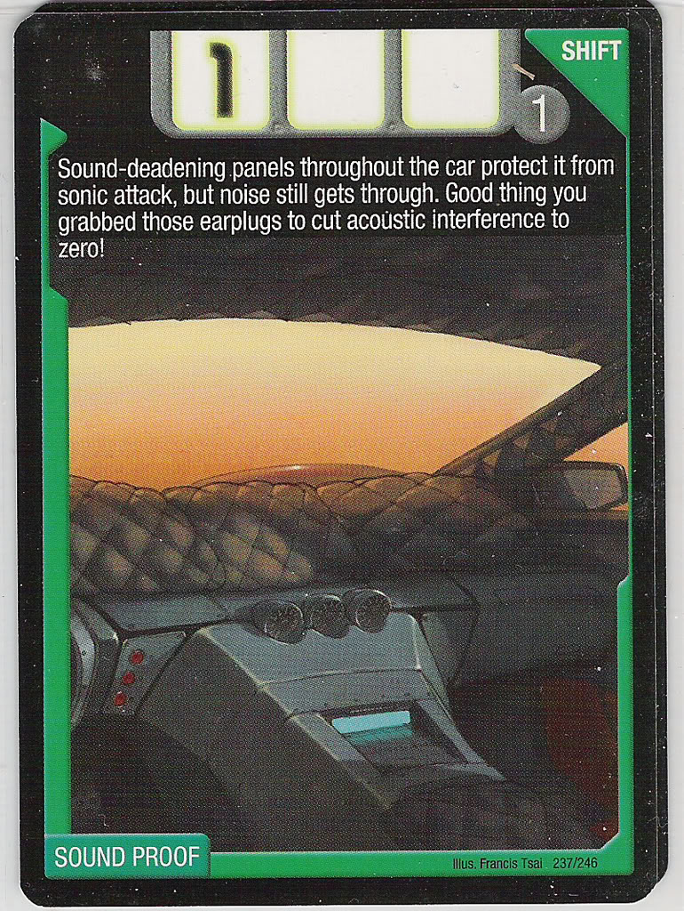
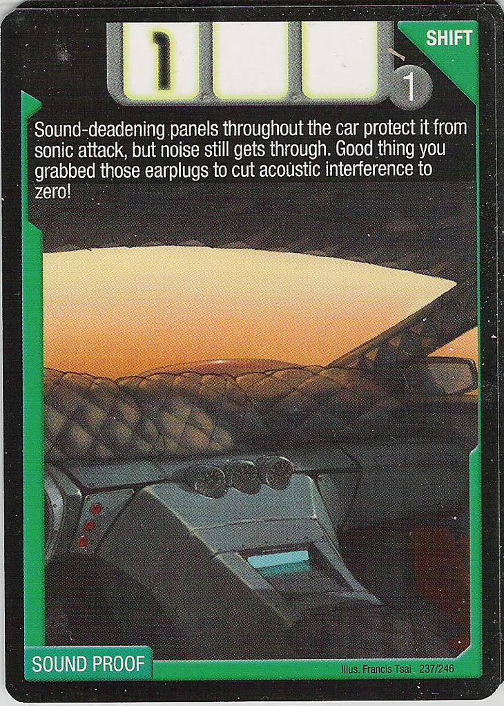

# Trading Card Image Resizer

A basic script that crops .jpg files to be as close as possible to the 1.4:1 aspect ratio of trading cards.

**NOTE**: It considers whitespace along the image border for what to remove (this is a specific use case for my project).

## How to Use

The steps:
1. Add image files to the `/input` directory. 
2. Run `python main.py`.
3. See output files in `/output` and report in `output.txt`.

The images for my project included the following:
- .jpg files
- height range: between 709 and 777
- width range: 1023 or 1024

## Example Output

An example before and after of the image and aspect ratio changed. It's subtle but the whitespace was trimmed from the LEFT and BOTTOM sides of the image.

Before | After
:-----:|:-----:
 | 
1.3299 | 1.4000

## Sources
- https://pillow.readthedocs.io/en/stable/reference/Image.html
- https://www.mathworks.com/help/images/image-coordinate-systems.html

## License
[MIT](LICENSE)
